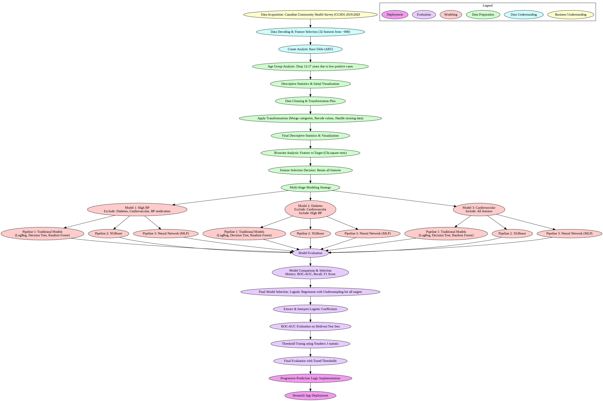
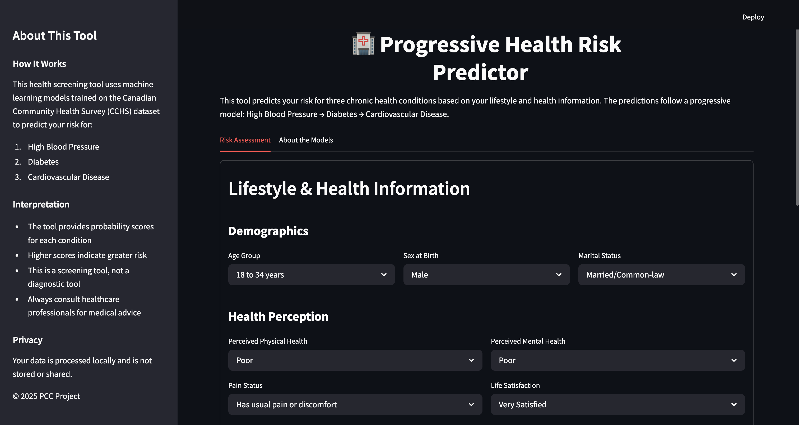

# PCC: Predicting Chronic Conditions Using Machine Learning

A screening-oriented modeling pipeline for high blood pressure, diabetes, and cardiovascular risk using the Canadian Community Health Survey (CCHS) dataset.

## Abstract

This project presents Predicting Chronic Conditions Using Machine Learning (PCC)—a screening-oriented data science pipeline designed to predict three critical chronic conditions: high blood pressure, diabetes, and cardiovascular disease. Using the Canadian Community Health Survey (CCHS) 2019–2020 dataset, we apply a modular and interpretable machine learning approach across progressively dependent targets. Preprocessing involved rigorous value cleaning, categorical transformation, and bivariate statistical analysis. Multiple models were evaluated, including logistic regression, decision trees, random forests, XGBoost, and neural networks, using both SMOTE and undersampling to address class imbalance. Logistic regression, optimized for recall using Youden's J statistic, emerged as the most interpretable and reliable model. The final deployment includes a Streamlit-based health screening tool enabling progressive risk prediction. This system supports early intervention and personalized screening in non-clinical settings, demonstrating the potential of interpretable machine learning in public health applications.

## Project Overview

This project applies machine learning techniques to predict three critical chronic health conditions using survey data. The system is designed as a progressive risk assessment tool that follows clinical progression patterns (High BP → Diabetes → Cardiovascular Disease).

## Project Flow Diagram

The following diagram illustrates the complete workflow of our project, from data acquisition to deployment, following the CRISP-DM methodology:

## Key Features

- **Multi-target prediction** for three chronic conditions
- **Interpretable models** optimized for screening (high recall)
- **Progressive prediction** allowing partial information input
- **Threshold-optimized** classification using Youden's J statistic
- **Deployment-ready** with Streamlit interface

## Interactive Streamlit Application

We've developed an interactive web application using Streamlit that allows users to input their health information and receive personalized risk assessments for high blood pressure, diabetes, and cardiovascular disease.

### Application Features:

- **User-friendly Interface**: Clean, intuitive design with organized input sections
- **Progressive Risk Assessment**: Follows the clinical progression pattern of chronic conditions
- **Real-time Predictions**: Instant feedback on health risks with probability scores
- **Visual Risk Indicators**: Gauge charts and color-coded results for easy interpretation
- **Privacy-focused**: All data is processed locally and not stored or shared

### Streamlit Application Screenshot:

### How the Application Works:

1. Users input their demographic and health information through an intuitive form
2. The application processes this information through our trained machine learning models
3. Risk predictions are calculated for each condition following the progressive model
4. Results are displayed with probability scores and visual indicators
5. Users can explore different scenarios by modifying their inputs

## CRISP-DM Methodology

This project follows the Cross-Industry Standard Process for Data Mining (CRISP-DM):

1. **Business Understanding**
   - Identified need for early screening of chronic conditions
   - Defined objectives: create interpretable, recall-optimized models for screening

2. **Data Understanding**
   - Analyzed Canadian Community Health Survey (CCHS) 2019-2020
   - Selected 32 relevant features from ~690 available variables
   - Created comprehensive data dictionary and feature descriptions

3. **Data Preparation**
   - Decoded categorical variables using CCHS documentation
   - Filtered age groups with insufficient positive cases
   - Transformed ambiguous responses and merged sparse categories
   - Created target-specific datasets to prevent data leakage

4. **Modeling**
   - Implemented multiple modeling pipelines (traditional, XGBoost, neural networks)
   - Addressed class imbalance using undersampling and SMOTE
   - Performed cross-validation with multiple metrics (prioritizing recall)
   - Selected Logistic Regression as final model for all targets

5. **Evaluation**
   - Evaluated models using ROC-AUC, recall, precision, and F1-score
   - Optimized decision thresholds using Youden's J statistic
   - Analyzed feature importance through logistic coefficients
   - Validated on held-out test sets

6. **Deployment**
   - Developed Streamlit application for interactive risk assessment
   - Implemented progressive prediction logic
   - Created interpretable risk outputs for non-technical users

## Data Preparation Experiments

- **Age Filtering**: Analyzed target distributions for the age group 12–17. Due to extremely low prevalence (BP: 40, Diabetes: 12, Cardio: 14 positive cases), this age group was removed to ensure reliable modeling.
- **Iterative Transformations**: Consolidated ambiguous responses ("Refusal," "Not stated," "Valid skip") into "Unknown" or logically replaced them. Merged sparse categories to ensure feature stability.
- **Bivariate Analysis**: Conducted Chi-square tests and visual plots for all target conditions, showing strong statistical associations with most features (p-values close to 0).

## Modeling Approach

### Class-Imbalance Handling
- **Undersampling**: Reducing majority-class observations to balance classes
- **SMOTE**: Synthetic Minority Over-sampling Technique for increasing minority-class observations

### Model Pipelines
- **Traditional Models**: Logistic Regression, Decision Tree, Random Forest
- **Gradient Boosting**: XGBoost Classifier
- **Deep Learning**: Neural Network (MLP)

### Cross-validation & Metrics
- 5-fold stratified CV with multi-metric scoring: F1-Yes, Recall-Yes, ROC-AUC
- Reported mean ± standard deviation for reliable performance estimation

## Key Results

| Condition | Model | ROC-AUC | Recall (Default) | Recall (Optimized) |
|-----------|-------|---------|-----------------|-------------------|
| High BP | Logistic Regression | 0.810 | 0.785 | 0.960 |
| Diabetes | Logistic Regression | 0.853 | 0.803 | 0.960 |
| Cardiovascular | Logistic Regression | 0.856 | 0.814 | 0.950 |

### Model Comparison
- Logistic Regression offered the best trade-off between recall and interpretability
- XGBoost and MLP performed slightly better overall but lacked interpretability
- Decision Tree and Random Forest showed decent performance but decreased interpretability with complexity

### Threshold Optimization
Modified Youden's J statistic [maximizing (Recall + Precision - 1)] substantially improved recall of our final Logistic Regression models, prioritizing early detection while accepting a minor trade-off in precision.

## Usage

To run the Streamlit application:

\`\`\`bash
streamlit run app.py
\`\`\`

## Requirements

- Python 3.8+
- pandas
- scikit-learn
- imbalanced-learn
- xgboost
- tensorflow
- streamlit
- matplotlib
- seaborn

## References

- Statistics Canada. 2020. Canadian Community Health Survey (CCHS) 2019–2020 Public Use Microdata File. Statistics Canada.
- M. Panahiazar, C. Taslimitehrani, M. J. Jadhav, and H. R. Pathak. 2015. Using EHRs and machine learning for diabetes risk prediction. In AMIA Annual Symposium Proceedings, 2015: 1899–1908.
- M. T. Ribeiro, S. Singh, and C. Guestrin. 2016. "Why Should I Trust You?": Explaining the predictions of any classifier. In Proceedings of the 22nd ACM SIGKDD International Conference on Knowledge Discovery and Data Mining (KDD '16), 1135–1144.
- N. V. Chawla, K. W. Bowyer, L. O. Hall, and W. P. Kegelmeyer. 2002. SMOTE: Synthetic Minority Over-sampling Technique. Journal of Artificial Intelligence Research 16, 321–357.
- R. Fluss, D. Faraggi, and B. Reiser. 2005. Estimation of the Youden Index and its associated cutoff point. Biometrical Journal 47, 4, 458–472.